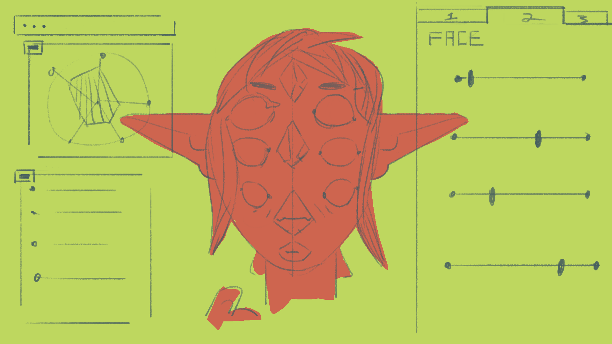
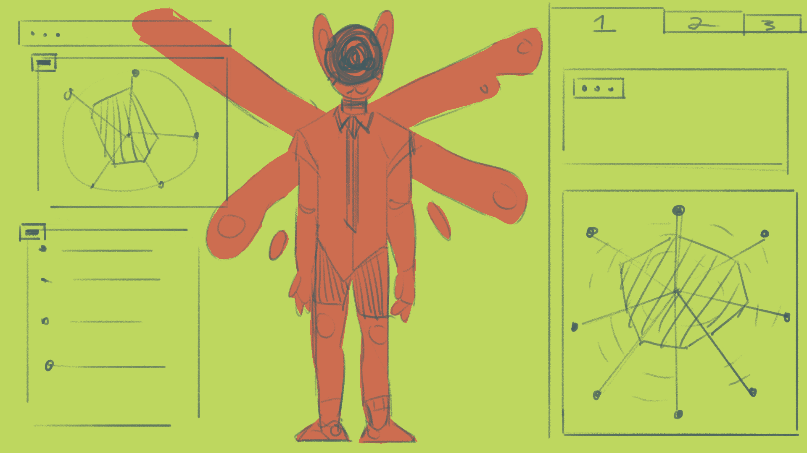
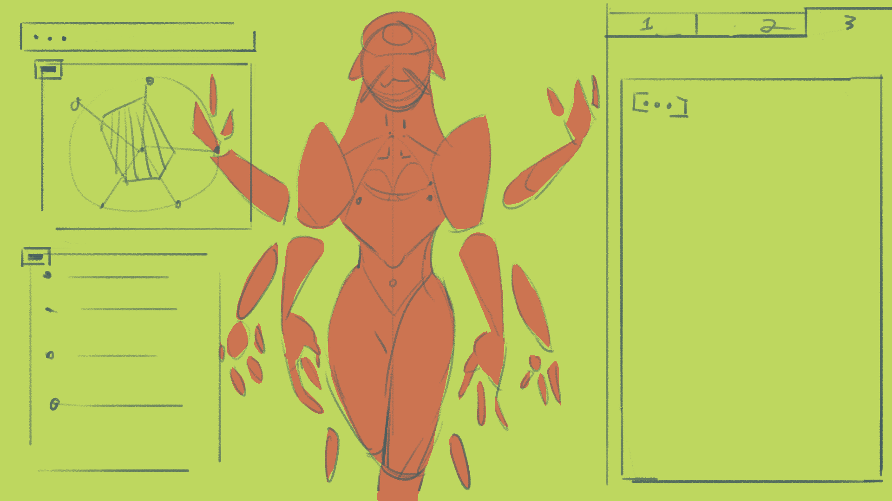
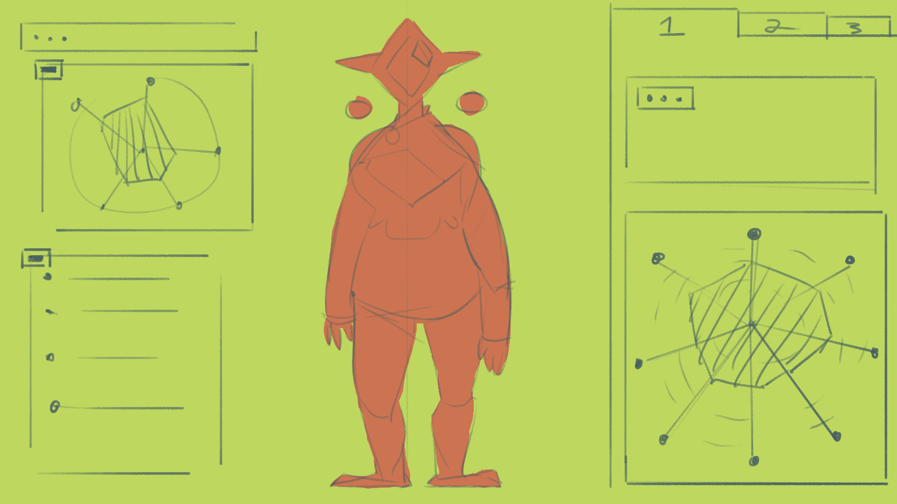
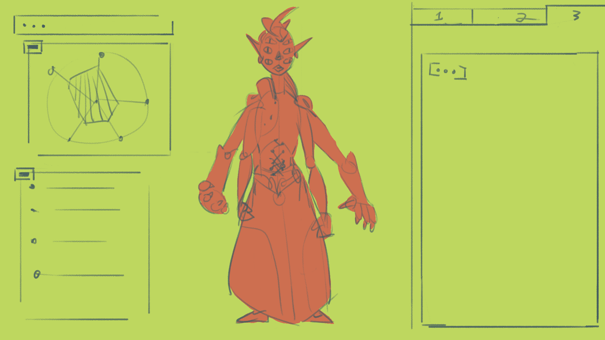
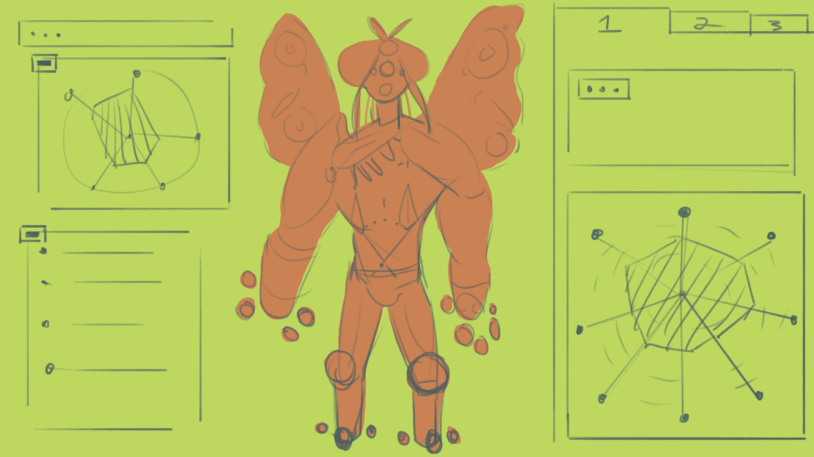
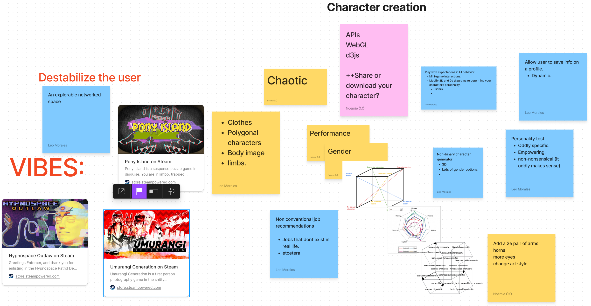
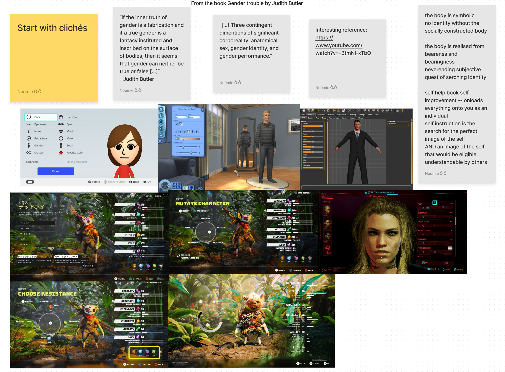

# n-spiritual persona
A silly and empowering non-binary character creator on the web!
## Artist statement:

n-spiritual persona is a character creator/ personality test that aims to celebrate the plurality of gender identity as it is performed online, trough videogames and networked spaces. The user can customize a 3D character along a spectrum of gender dimensions, imbuing it with personality traits that expand, empower and even destabilize --to gain a greater understanding of their conception of their own identity and performed gender online, and in real life.

---------------------
1. **Identity is a never-ending and subjective search that concerns all of us.**

	*“If the inner truth of gender is a fabrication and if a true gender is a fantasy instituted and inscribed on the surface of bodies, then it seems that gender can neither be true or false [...]” *
Butler, Judith. Essay. In _Gender Trouble: Feminism and the Subversion of Identity_, 171–80. Routledge, 1989.

It is interesting to study how individuals increasingly embrace the act of defying conventions, creating performed identities in a quest to create a self that  will both be liked by the individual and truly reflects the image that they want to convey to others, in a language that is still understandable to them.

On the internet, identities can take many forms; pseudonyms, online discourse or avatars. These fictional personas can be truly empowering, and can vary depending on the community, the virtual space and the image one wants to share with others and they are an important element of this dynamic and evolving digital culture. Online, individuals can perform identities free of the constraints of gender norms, social hierarchies, or physical attributes. When modeled in 3D, even gravity does not affect the garments we wear, and you don't even have to be confined as a human form. It can be a liberating experience to use the internet to explore one’s interests as a form of artistic expression in an anonymous context.

Even with all those liberties, some games or social media platforms still rely on very traditional character creation methods and offer only simplistic binary options. If limitless character creation is enjoyed by everyone, what would it look like if the character creation would reflect the complexity of creating an identity to perform in different online contexts? What kind of characters would be created if the parameters would transcend norms?

------------------------------
2. **Users will use the virtual space to explore various avatars in a destabilizing context.**

This counter-cultural and unconventional digital space will be destabilizing for various reasons. We want to throw out the window all those binary options and traditional ways to create an avatar that will truly reflect the user’s physical image. Instead, the user will navigate hazardly between complex options and diagrams, with no idea of how it will affect the three dimensional avatar that he is modeling. 

The overarching aim is to prompt users to reflect on how complex and sometimes unpredictable factors affect the creation of our identities. We strive to convey that imperfection is not only acceptable but perhaps even preferable. Perfection is an elusive goal; instead, users are encouraged to arrive at something they genuinely appreciate, something they can continually refine and mold indefinitely, something uniquely personal. The objective is to foster an environment where the user is free to enjoy exploring their own likes and dislikes, and to dedicate their time to the art of modeling and the expression of their boundless creativity. It's a sanctuary for self-discovery, where the journey itself becomes the destination.

------------------------------
3. **An empowering space for exchange and creativity**

The satirical tone in this character creation tool is meant to be aimed in the direction of normative, binary, views on gender. The n-spiritual persona character creator seeks to foster a wholesome atmosphere and a safe space for exploration. One that while remaining silly, comedic and even weird, also respects the lived experience of 2SLGBTQ+ individuals. It's mechanisms of representation, while being largely unpredictable and subversive, seek to offer a means of expression and reflection for anyone exploring their gender identity online.

“[...] Three contingent dimensions of significant corporeality: anatomical sex, gender identity, and gender performance.” - Judith Butler 

## Storyboard:

## References:
- [Why Doesn't the Industry Make Good Girls' Games?](https://www.youtube.com/watch?v=-BtmNI-xTbQ)
	-  A video essay about gendered games, the historical re-enforcement of stereotypes in triple-A games, the misinterpretation of market data by the videogame industry about what girls want in games, and the game-mechanical essence of playing dress-up in both games marketed to boys and those marketed to girls. Also a lot more than that, including the efforts of indie developers and players to create better games for girls, and the celebration of engaging and 'good' games marketed to girls.
	
- [Eorzea Collection | Glamours Collection ](https://ffxiv.eorzeacollection.com/glamours)
	- An online community gallery dedicated to sharing and celebrating the fashion choices of players in Final Fantasy XIV.
	
- [Find Out Your Type Of Peeps](https://event.designexpo.org.tw/en/)
	- A whimsical, mystical personality test from the Taiwan Design Expo. Inspiration for it's wholesome tone and engaging personality trait distillation, as well as it's abstract 'narrative' mechanics. 
	
- [Gender Trouble | Book by Judith Butler](https://en.wikipedia.org/wiki/Gender_Trouble)
	- Gender theory discourse. Social theory background.
	
-  [Hypnospace Outlaw](https://store.steampowered.com/app/844590/Hypnospace_Outlaw/)
	- Chosen as reference mainly for its classic net-art and 3D graphic style. More generally inspiring for its internet navigation style interfaces, and narrative themes related to online identity.
	
- [Umaragi Generation](https://store.steampowered.com/app/1223500/Umurangi_Generation/)
	- Referenced for its low-fi and effective 3D art style, and for it's environmental storytelling and subtly integrated social commentary on youth culture in a dystopian cyberpunk setting.
	
- [Pony Island](https://store.steampowered.com/app/405640/Pony_Island/)
	- Inspiration for it's reversal of Interaction design tropes & the way it plays with player expectations.
## Ideation:

## Moodboard:

