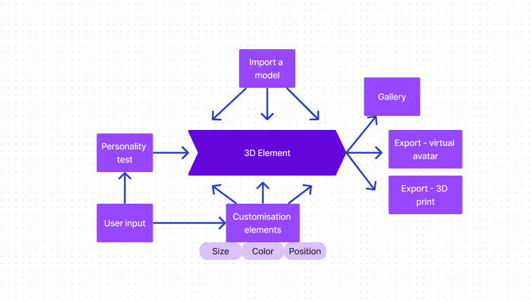

# Prototype
---------
n-spiritual persona is a character creator/ personality test that aims to celebrate the plurality of gender identity as it is performed online, trough videogames and networked spaces. The user can customize a 3D character along a spectrum of gender dimensions, imbuing it with personality traits that expand, empower and even destabilize --to gain a greater understanding of their conception of their own identity and performed gender online, and in real life.
More concretely, the user will be asked to answer questions about their preference in certain situations, like in the personality test [Find Out Your Type Of Peeps](https://event.designexpo.org.tw/en/). The character creator will generate a radar chart and an avatar based on the results as an inspiration, that the person can modify afterwards. The art style focuses on a plurality of body shapes, invites the user to add limbs, play with different colors, and move 3D objects around. At the end of the experimentation, the user can save the avatar in a public or private gallery, and/or export it to 3D print.

Note: abobe link to the Taiwan Exhibition elemental personality test seems to be broken. [Here's a reddit thread that lists all the results](https://www.reddit.com/r/mbti/comments/16zitd6/taiwan_design_exhibition_2023_innate_personality/) 

Prototype stage: 
- Creating basic 3D shapes in blender
- Implementing those in the website using three.js
- Creating the structure of the graphical user interface (GUI) using the addon lil-gui
- Creating a basic color variation
- Creating a radar chart using a data visualization API

What's left to do for the final:
- Creating more variants in blender
- Adding more customization options like position and size
- implementing those in the GUI
- Writing the personality test questions and creating a page for it.
- Creating a gallery page for the display of the projects
- Enabling the user to download their creation
- Creating a human template the user can download and modify on their own machine.
- Enabling the user to import 3d shapes on the website

## Components/features:
---------------

- **3D elements**
	The body separated in different elements like arms, legs, head, ears, and torso.
- **Customization elements (like the radar chart)**
	Will allow the user to modify the position, size and color of the elements
- User input
- Personality test
- Personal/public gallery
- Download a model
- Import a model

## User Testing & Feedback
------------------
### Demo observations and procedure
We took a non-prescriptive approach to user testing that involved a more conversational data gathering method while demonstrating the prototype live, rather than a structured set of questions about features and specific aspects of the experience after un-contextualized exposure to the prototype. Given the stage of development we thought that giving an explanation of intentions and creative context for the piece was the better approach to surface questions and use case possibilities from potential users.

Some common threads of inquiry by the part of the users where surrounding the uses of the character after creation, and the importance of prioritizing diversity and adequate queer representation. The possibilities we presented for the first area of concern (saving created characters into a user profile, implementing the ability to share then in a public gallery) were complimented by the suggestion of considering a download feature of the 3D asset file for further creative iteration in digital content creator software and for use in other applications. For the second area of concern, or primary response was to emphasize the role that an active community would have on building a diverse pool of fashion choices, art styles and body type bits of character via the ability to upload their own 3D assets into the platform. However a considerable amount of work up-front would still be assumed to create the condition for such a community to congregate in the first place. Making our goals explicit in concept and implementation of our initial design is the first step in achieving this.

Stemming from the use-after-creation thread of conversation, the question of privacy also came up. Would other people have access to the characters in my profile? Would they be able  to download them? Or would I have the ability share them in a public gallery at my discretion?. This type of question are disembodied examples of the general thoughts arising from that conversation.
### Peer feedback:

**Thomas Rompré:**
"Very cool implementation of the subject! With a bit of development i think you could create some really unique avatars and event expand into more non-human like avatars and shapes. Concept art really sold the idea too. Try and double down on making the avatars and UI feel surrealistic and dreamlike to cement the project's identity and message, further differentiating it from your typical character creator.""

**Jennifer Brown:**
"Very nice concept and design! I think the focus on non-binary character creation is a really smart idea - I think its very narrative relevant and the direction I personally hope more character creators move towards, but it also saves you the work of distinguishing features by gender or risking accidental stereotyping. I think the overall concept of generating a character based on a quiz is super appealing as well - I could see this catching the attention of a lot of people. Regarding the 3D models and materials, I would think more about the desired end result after generating this character - is it being posted to social media? Downloaded to Blender? 3D printable? This might make your priorities (form v. texture) a bit clearer. Good luck! I want to play this!!""
## Reexamination
-------

Ideas to redirect/define the project idea

Implementing images and sketches as inspiration
Importing a template for blender and maybe instructions
Exporting towards an online library but also as a product, as a print OR as a 3d printed figurine.
(if we are focusing on 3d printed figurine, we can focus more on shapes than on textures and colors)
Focus on bodies plurality more than on fashion and clothing
No hair
Open source? only images? share shapes?

